# TTC_Subway_Delays_Tableau_Analysis

## Project Overview
TTC Subway Delays have been a major issue for Toronto's commuters for years. This analysis aims to use Tableau to visualize the data from 2014 to 2020, and identify key insights with respect to the trends of delays, main causes of the delays, and conclude with a number of course of action for TTC's management to undertake and improve its subway operations.

## Data Source

- TTC Subway Delay Data from Jan 2014 to Oct 2020: [City of Toronto Open Data](https://open.toronto.ca/dataset/ttc-subway-delay-data/)

- TTC Monthly Ridership Data from Jan 2007 to Mar 2021 : [City of Toronto Open Data - Toronto's Dashboard](https://www.toronto.ca/city-government/data-research-maps/toronto-progress-portal/)

## Tools

- Data Transformation: Power Query, Excel

- Data Visualization: Tableau Public

## Data Transformation

- Both Delay Data and Ridership Data were downloaded from City of Torono Open Data as excel files.

- Data transformation, such as connecting to and appending all excel files together to produce a combined Delay Data csv file, and pivoting the Ridership Data for ease of use, were performed with Power Query.

- Please see the ReadMe File under the Data Transformation Folder for details.

## Results

### [Click here to see the Tableau Story !](https://public.tableau.com/profile/anthony.ng2094#!/vizhome/TTCSubwayDelaysVisualized/TTCDelayStory)

Note: Below graphs are screenshots from the Tableau Story; Wit the Talbeau Story opened, details of each data point will be shown by hovering your cursor on the data points.

- TTC Subway delays have been deteriorating in the past few years. As shown in below graphs (orange line on the left, and red line on the right graph), delays increased sharply in 2018 eventhough ridership had fallen slightly that year. In 2020, on average, the subway gets delayed by 123 minutes per day despite significant drop in Average Monthly Ridership from over 43M monthly riders in 2019, to below 20M monthly riders in 2020. In other words, Average Monthly Ridership fell by 55% year-over-year (YoY), but Average Minutes Delayed per Day was only reduced by 3%. (Note: Average Monthly Ridership Data covers all of TTC's services, which includes the Subway, Bus, and Streetcars. There is no further breakdown of ridership by type of services. Hence, the total for all 3 types of services is used as a proxy to reflect the change in level of subway ridership YoY)
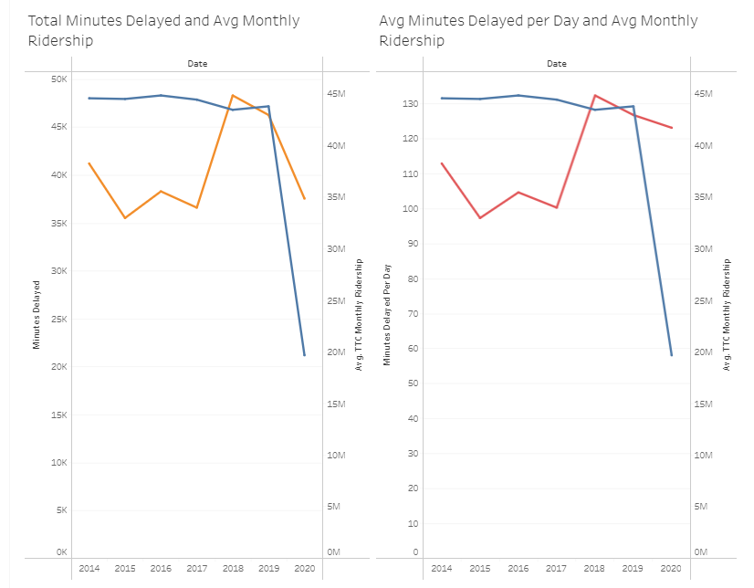</img>

- Subway delays tend to be worse on Weekdays, during commuting hours in the morning and the evening. Based on data from Jan 2014 to Oct 2020, Toronto's commuters can expect delays of at least 9 minutes on Monday and Tuesday mornings from 6 to 7am, as well as Thursday evenings from 4 to 6pm.
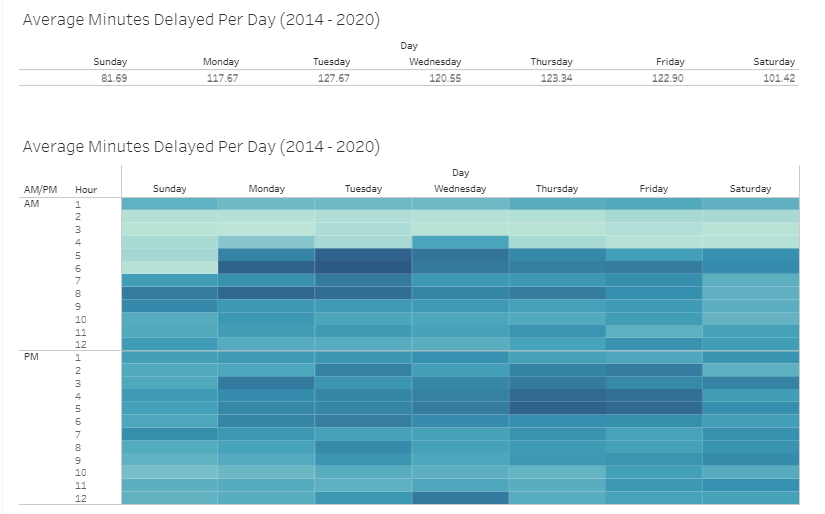</img>

- What are the causes for these delays? From 2014 to 2020, the most common cause for delays were incidents inolving disorderly patrons and transporting injured or ill customer on train.
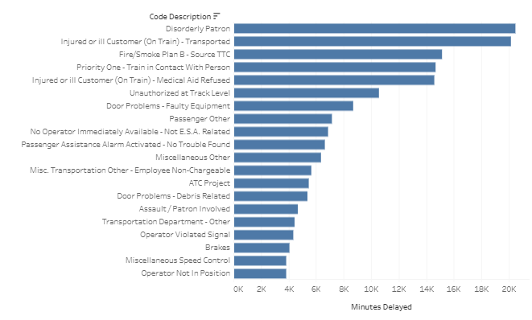</img>

- By taking a closer look, we can see that incidents involving disorderly patrons have been getting worse YoY. In addition, "No Operator Immediately Available - Not E.S.A. Related" has caused a total of 4,283 minutes of delay in 2020, despite ridership falling by half. This suggests a ver serious operational and logistical problem.
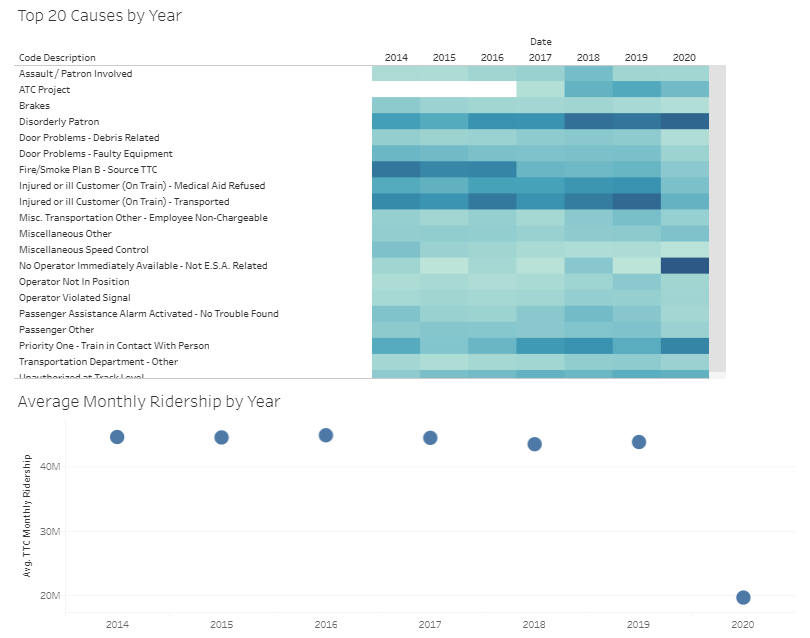</img>

- Further examining delays in 2020 more closely, incidents involving train in contact with person or unauthorized person at track level have caused significant delays as well. This suggests that there are serious security issues to be addressed by the TTC.
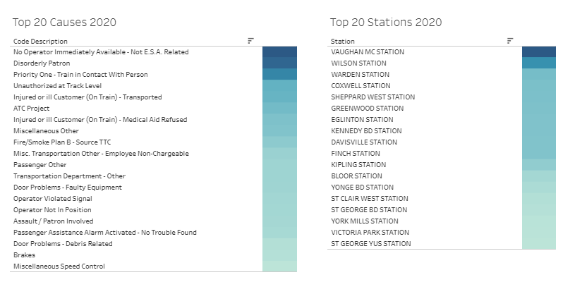</img>

- Top 3 causes for delays in 2020 have affected the below stations the most. Having no operator immediately available had caused significant delay at Wilson Station, a total of 886 minutes in 2020.
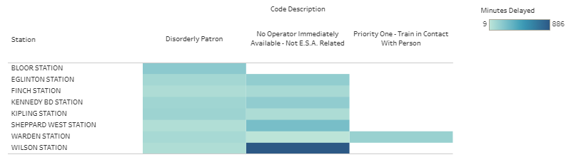</img>

- Taking a closer look at the top 2 stations with significant delays in 2020, it is clear that the issue of having no operator immediately available is especially problematic at Vaughan Metropolitan Center Station, with a staggering 1,077 minutes delayed in 2020. This accounts for over 58% of the total delays (1,842 minutes) occured at this station in 2020.
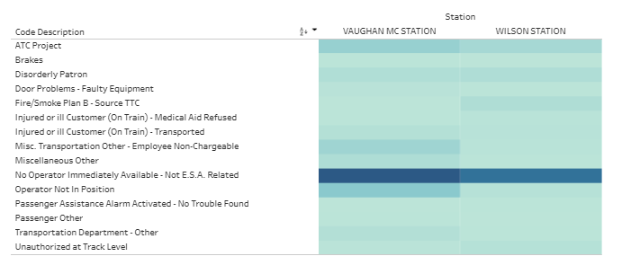</img>

- By examining the total number of minutes delayed due to "No Operator Immediately Available - Not E.S.A. Related", we can see that Greenwood Station and Sheppard West Station were heavily impacted as well, especially in 2020.
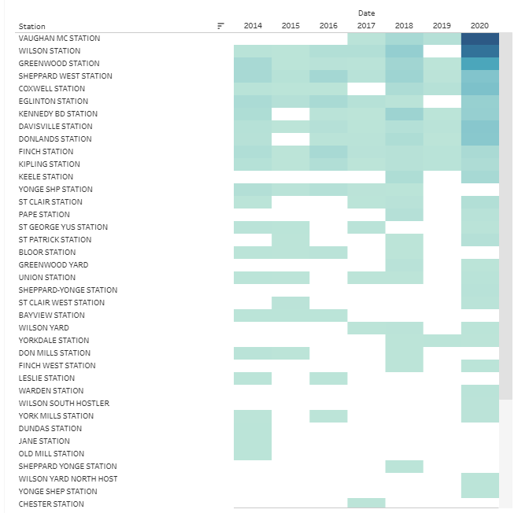</img>

-  In addition, the TTC should put a much higher emphasis on security and measures to handle and/or prevent incidents involving disorderly patrons, 
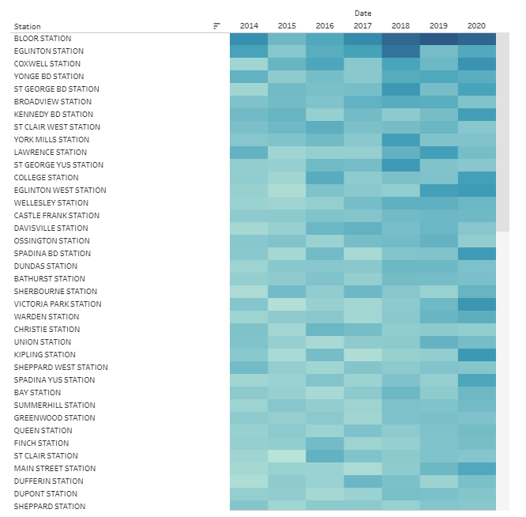</img>

### Additional Features on Tableau Story
On the last 2 pages of the Tableau Story, the user can examine the trend in average minutes delayed per day due to specific causes by entering keywords like "door" in the search box.

#### Average Minutes Delayed Per Day in Each Year
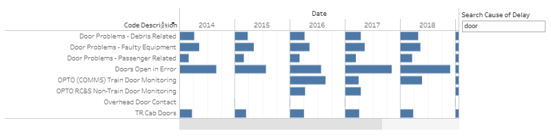</img>

#### Average Minutes Delayed Per Day in Each Year, broken down by Station
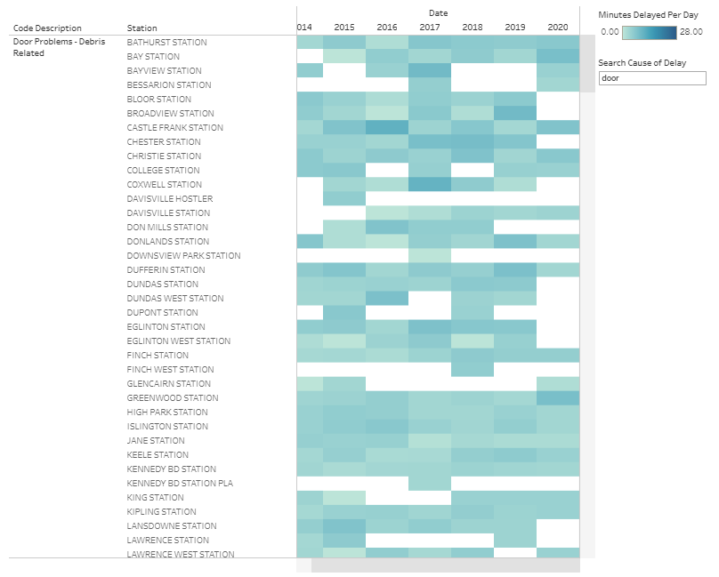</img>

## Conclusions

There could be many reasons why subway delays could occur. In fact, based on the Subway Delay Codes, the TTC lists out 129 different causes of delays. While causes like technical or system issues are unpredictable, and passengers' medical conditions will require immediate attention, there are other causes of delays that could be prevented. Indeed, as shown in the above analysis, these issues are causing the most delays in 2020. The TTC should take initiatives to better manage its logistic schedule for operators in order to ensure the subway operations are ran smoothly. In addition, disorderly patrons have been an issue for a long time. The TTC should put revisit its policy and measures on handling/preventing similar incidents from disrupting normal subway services.