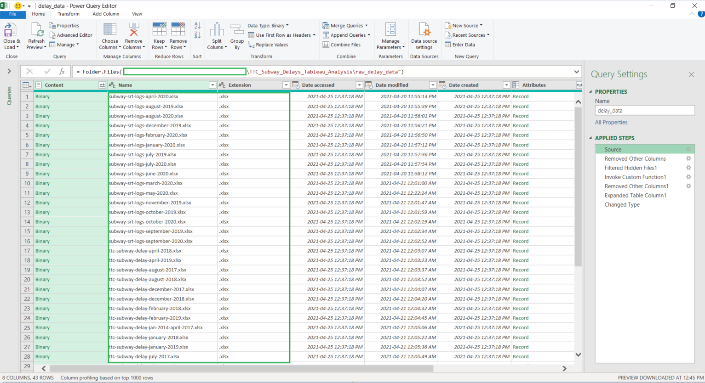
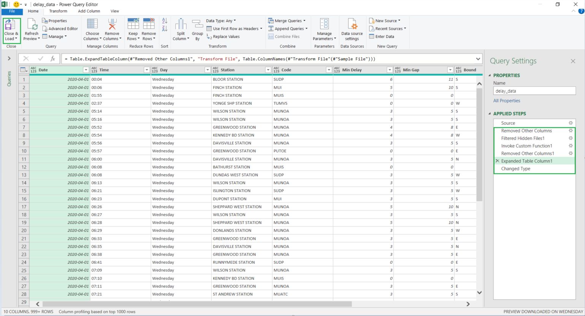
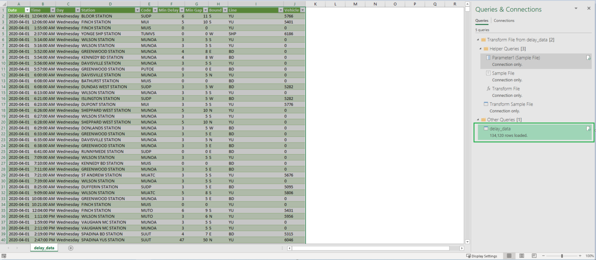
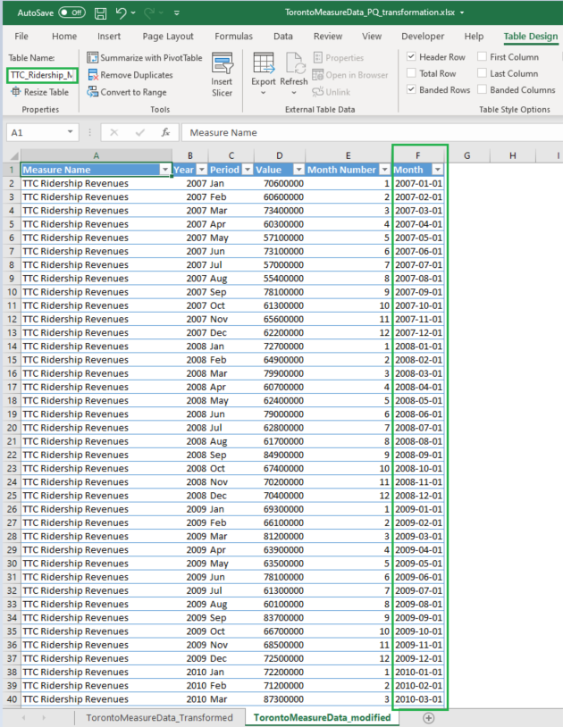
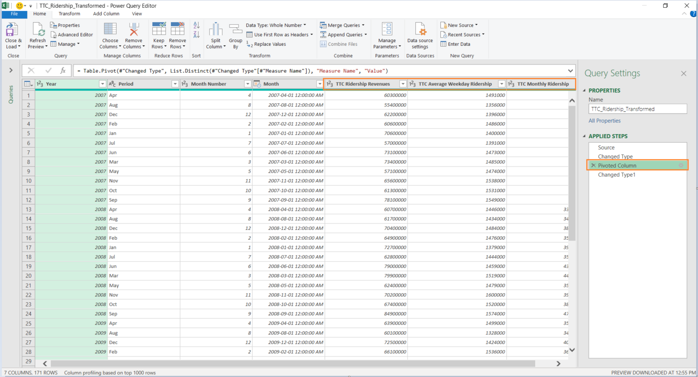
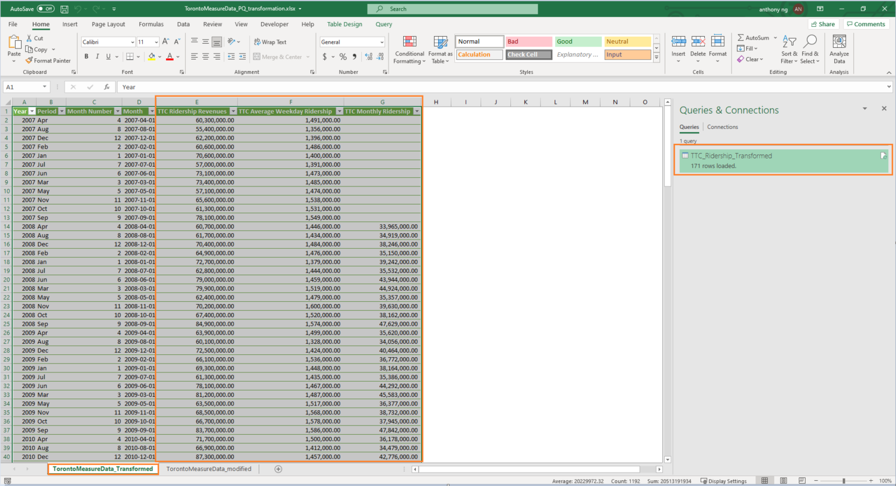

# TTC_Subway_Delays_Tableau_Analysis

## Data Transformation Overview

- Both Delay Data and Ridership Data were downloaded from City of Torono Open Data as excel files.

- Data transformation, such as connecting to and appending all excel files together to produce a combined Delay Data csv file, and pivoting the Ridership Data for ease of use, were performed with Power Query.

## Data Transformation for Delay Data

1. Connect with all Excel files downloaded from City of Toronto Open Data
</img>

2. Append all Excel files together and expand content
</img>

3. Close and load data as one combined table
</img>

4. Copy and paste data on a new Excel file, save as CSV file for Tableau to create a connection.

## Data Transformation for Ridership Data

1. Take a copy of the Monthly Ridership Data downloaded from City of Toronto Open Data, and add an extra column to indicate the month of each row in the same format as the Date column from the Delay Data.
</img>

2. Column A from Step 1 includes 3 different items: Ridership Revenues, Monthly Ridership, and Average Weekday Ridership. With the help of Power Query, this table is pivoted to show the data in 3 different columns.
</img>

3. Close and load data as a new tab
</img>

4. Copy and paste the data in a new Excel file, remove revenue data as well as any rows prior to the year of 2014, and save as CSV file for Tableau to create a connection.